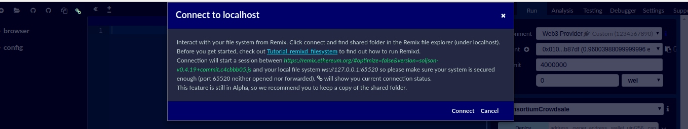
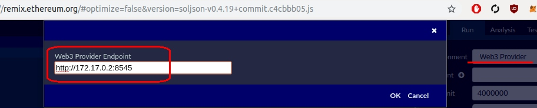
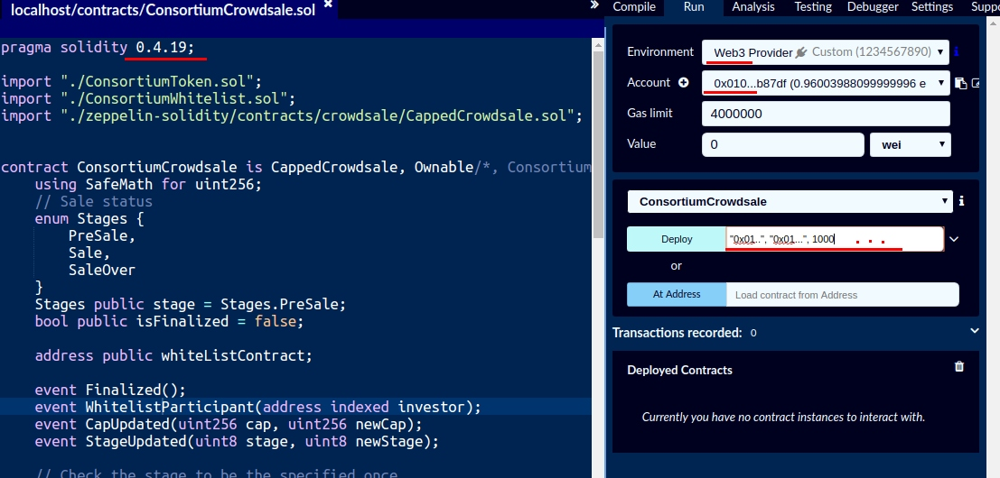

# Before Deploy & Test

## DLT/Blockchain Task

This is test task. The selected task from the three available is:

> *1. Create your own Cryptocurrency for a consortium of three participants.*

The following is also required:

> *Your solution should include all smart contracts you may need, all interfaces and services along with any logic for smart contract deployment, event retrieval etc. Unit tests should be present as should a mechanism to explore your blockchain solution. API specification should be done at the appropriate level as should any UI interface.*

Also, another requirement is to satisfy the following:

(a.)

> * i. Clearly define and build the proposed blockchain network

> * ii. Implement smart contracts for the tokens/assets/etc

> * iii. Implement smart contracts for the consortium management as needed

> * iv. In case of 1. above, write a sample dApp to show only the balance of each participant and transfer functions amongst them

----

## The Selected Blockchain Solution

The underling blockchain selected is Ethereum.

----

## Dependencies

All that you need is Docker and in order to build everything without problems, Ubuntu Linux.

* Ubuntu 16 or Ubuntu 18 recommanded
* Docker version 18.06.1-ce - https://www.docker.com/products/docker-engine

----

## Why Using Docker

This *docker* solution aims to help build a way to run the *Geth* client *in background* in such a way so that the boot process can be *monitored* easily by scripts in a **fast way** and as soon as the startup process ends those scripts will automatically trigger other events such as *mine* without losing any time. Once the docker container is up and running and mining blocks, tha bash console will be triggered to view logs or **gracefully kill** the Ethereum client.


The docker container will automatically (**1.**) Copy the genesis state file (genesis.json); (**2.**) initialise the genesis block after setting up static nodes and so on; (**3.**) Start by running the client with verification checkpoints at boot (ipc, rpc, etc); (**4.**) Connect to at least another peer; (**4.**) Start mining blocks automatically; (**5.**) Leave the user in bin bash to execute other commands or kill geth.

```
    +-------------------+      +-------------------+
    |                   +----->+                   |
    | 172.17.0.2 node01 |      | 172.17.0.3 node02 |
    |                   +<-----+                   |
    +---^---------------+      +------+----------^-+
    |   |                             |          |
    |   |                             |          |
    |   +-----+-------------------+   |          |
    |         |                   +<--+          |
    +-------->+ 172.17.0.3 node03 |              |
              |                   +--------------+
              +-------------------+
```

----

## Building Docker

First build the first image for the first node, then the second one then finally the third one with the following commands (make sure all other containers are stopped to avoid conflicts):

`docker build -t ubuntu-geth-node-stats01 --build-arg NAME=1 .`

`docker build -t ubuntu-geth-node-stats02 --build-arg NAME=2 .`

`docker build -t ubuntu-geth-node-stats03 --build-arg NAME=3 .`

----

## Running Docker

### Running Docker: Running the First Node

In order to get the first available IP (`172.17.0.2`) address for this node, make sure you run this first.

`docker run --rm -it --name node01 -h node01 ubuntu-geth-node-stats01`

### Running Docker: Running the Second Node

Run this after running the first one and after you see the node one showing `unlockDone` and you will get the correct ip (`172.17.0.3`).

`docker run --rm -it --name node02 -h node02 ubuntu-geth-node-stats02`

### Running Docker: Running the Third Node

Finally, run this last to after the second one to get the correct ip (172.17.0.4).

`docker run --rm -it --name node03 -h node03 ubuntu-geth-node-stats03`

----

## Details About Node Accounts Configuration

In order not to confuse the different ethereum addresses it is a good idea to use [vanity eth js](https://www.npmjs.com/package/vanity-eth) for every node in the order of the node names. For example, we could therefore have a vanity address that starts with `0` `x` **`01...`** for `node` **`01`** and another one that starts with `0` `x` **`02...`** for `node` **`02`** and so on.

!NOTE: The password is short and easy to remember but in real-life this should be replaced by a long password or replaced by **[Hardware Wallets](https://www.hardware-wallets.net/ethereum/)** or **[Secure Enclave](https://www.computerhope.com/jargon/s/secure-enclave.htm)**. In this experiment we will need to to use pwd: 123

----

## Details About Node IDs Configuration

To help easily debug the network and to understand what node is connected of course the `--identity` value parameter for `geth` is the best solution but if the user doesn't run geth with that parameter then it is hard to understand what node is connected to what so to make it simple the following nodes are sorted based on the final vanity id so that every node will start with something like `enode://` **`01...`** for `node` **`01`** and `enode://` **`02...`** for `node` **`02`** and so on.

----

## Details About Every Node Misc

More details about the first node

`enode://010516a6e3acd95b9cf69c39d1d799d3e9fb8bef76e4c53bc1b92753a73b03e2e1222119365508dbb2faf18b365d2d42c86a4d748b6a8a7d1fa11592afb55ac5@172.17.0.2:30303`

`0x010394e95e108465e438fd0af870f44ca47b87df`

More details about the second node

`enode://021e339379c1115da274bbd80f8014789c10682aa8b9e97a5a50d8c4127423fb628c8ab5e6bbc9d8e0ffbf1c7204d95f955ef17dcd06237eb5118820b8045cd0@172.17.0.3:30303`

`0x02090f81fb8c98017472f13cd334ddbd2448dd73`

More details about the third node

`enode://03a46d5f0b7a5de1c7b2d4233693dbf5991d949ff789fb108081f57d796988f7788e23100f33ed82b1360ffa975c989aa7e76a4bebcc8aa8e427893ce43dd1f6@172.17.0.4:30303`

`0x030f23b9f8b5adba8c0fdb58e79b398420cb9b89`

----

# The Token

In this project there is a test token callend *Consortium*. Just to make things closer to what people usually do, there is another sale contract that needs to be deployed first (`ConsortiumCrowdsale.sol`) because this one will automatically deploy the *token contract* as well (`ConsortiumToken.sol`) and finally the *whitelist* smart contract will be deployed as well (`ConsortiumWhitelist.sol`) and the caller will be added in the *whitelist* so that he/she can add others.

## The Token: Testing Env

In order to deploy and test the smart contracts, because there are no deployment scripts for now, you need to use an online compiler like  **[Ethereum Remix](https://remix.ethereum.org)**. In addition to avoid the the process of trying to copy and paste all the files (especially with the Open Zeppelin libary) it is a good idea to  order to run a [remixd](https://www.npmjs.com/package/remixd) server.



After that just open the first smart contract (`ConsortiumCrowdsale.sol`) and connect to Web3 Provider with:

http://172.17.0.2:8545



## The Token: Deployment

In order to deploy, after you are done with connecting the *Remix Web IDE* to the *remixd localhost* and after you are done connecting to the IDE to one fot the three *Web3 Providers*, open the main smart contract `ConsortiumCrowdsale.sol` and deploy with the following parameters:

`"0x010394e95e108465e438fd0af870f44ca47b87df", "0x010394e95e108465e438fd0af870f44ca47b87df", 1000`

Where the parameters are `address _owner` (for changing things like the end date), `address _wallet` (for collecting wei), `uint256 _cap` (for cap in tokens).


